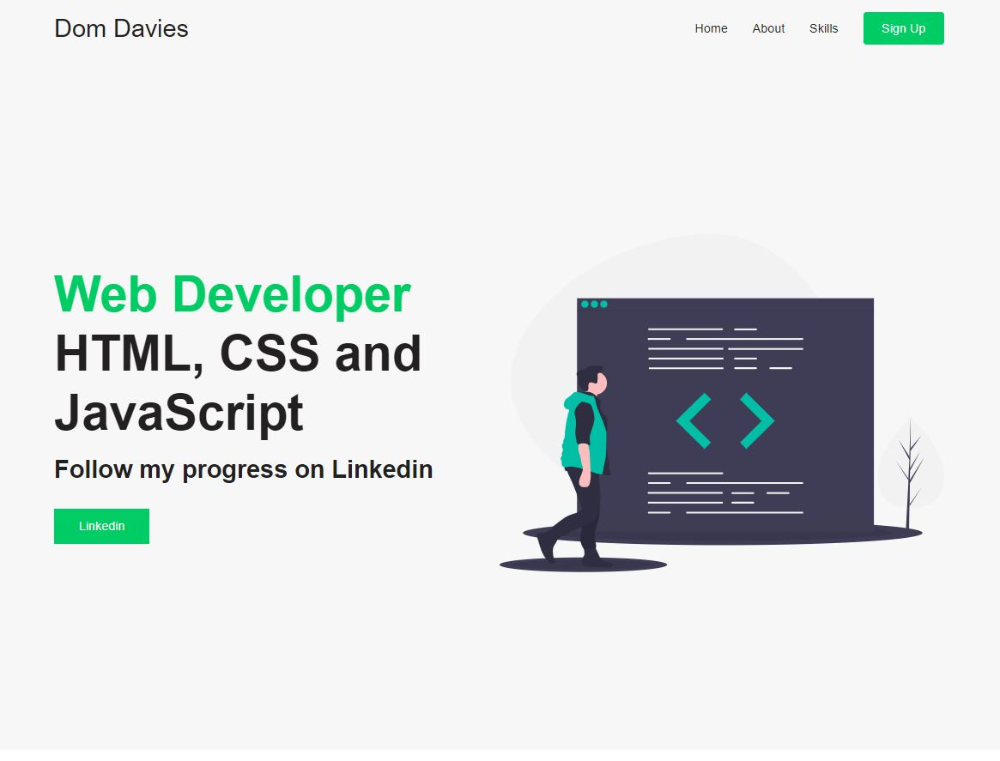
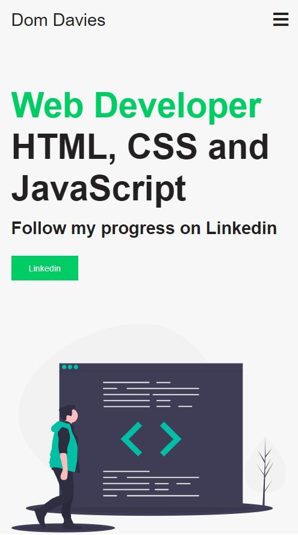

# my first Sass project

Eventhough this is a tiny project I managed to get lots of Sass done.

* Used variables for colors
* Nesting styles
* partials
* basic mixins
* @extend method
* referencing parent selectors with &

Big thanks to Sass Essential Training @linkedin learning and YouTube channel Brian Design.

I started this project over 3 weeks ago but my Sass live compiler extension wasn't working in VS code.
I managed to fix it a few days later but had already moved onto something else.
I've since heard the extension hasn't been updated this year and is misbehaving!

I get my font-awesome SVG, font, and CSS toolkit here: [https://cdnjs.com/libraries/font-awesome] 

